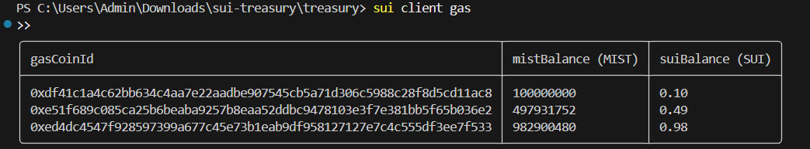
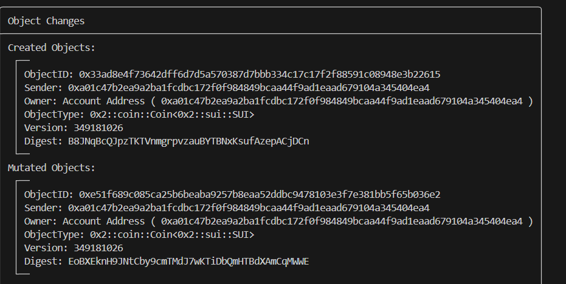
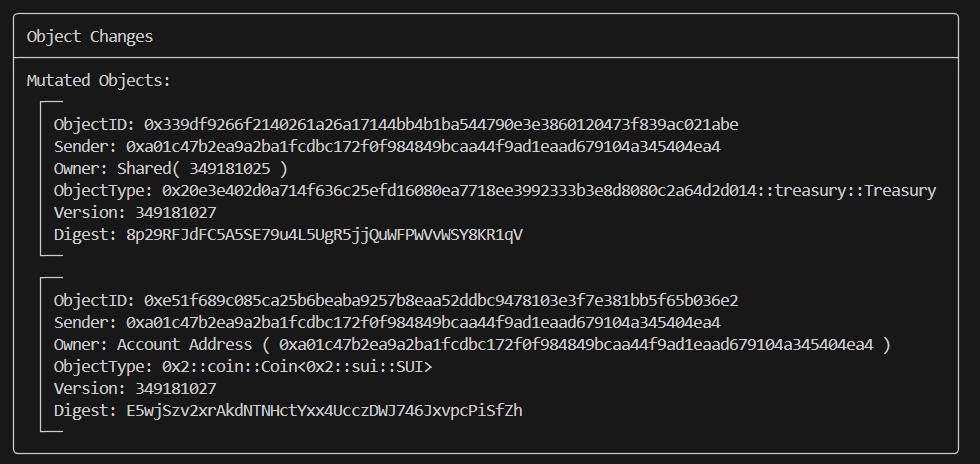
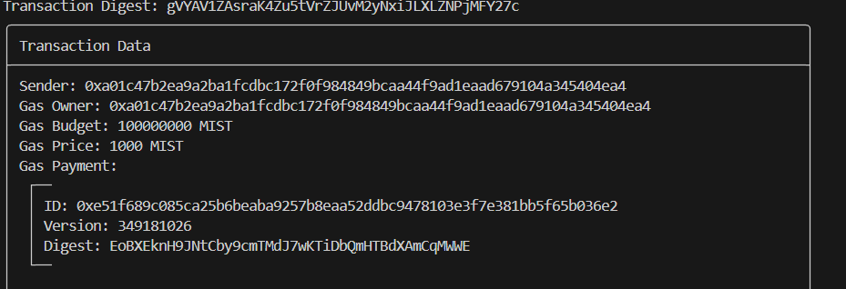
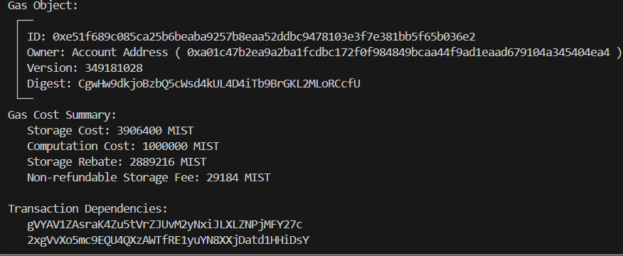
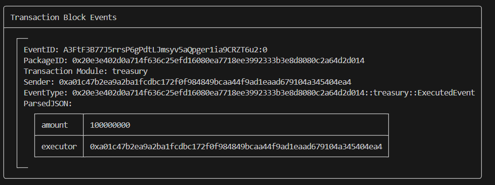

🚀 Multi-Signature Treasury Smart Contract (Sui Blockchain)

Team ID: p_bhargavi

Theme: Multi-Signature Treasury

Package ID: 0x20e3e402d0a714f636c25efd16080ea7718ee3992333b3e8d8080c2a64d2d014

Treasury Object ID: 0x339df9266f2140261a26a17144bb4b1ba544790e3e3860120473f839ac021abe


✅ Project Summary

This project implements a Multi-Signature Treasury System on the Sui Blockchain using Move language.
It supports:

Creation of a shared treasury

Multi-owner approvals

Secure deposits

Executed-event tracking

On-chain payment execution

Full Testnet deployment and working demo

📦 Contract Files
```
sui-treasury/
 ├── Move.toml
 ├── Move.lock
 ├── sources/
 │     └── treasury.move
 ├── tests/
 └── build/
```

🛠 Commands Used (Demo Script)
1️⃣ Check Wallet
```
sui client gas
```

2️⃣ Check Public Key / Address
```
sui client active-address
```

3️⃣ View All Objects
```
sui client objects
```

4️⃣ Create Treasury
```
sui client call --package <PACKAGE_ID> --module treasury --function create_treasury \
  --args '["<wallet_address>"]' 1 --gas-budget 100000000
```

5️⃣ Deposit
```
sui client call --package <PACKAGE_ID> --module treasury --function deposit \
  --args <treasury_object_id> <coin_object_id> --gas-budget 100000000
```

6️⃣ Execute Payment
```
sui client call --package <PACKAGE_ID> --module treasury --function execute_payment \
  --args <treasury_id> <amount> '["<approvers>"]' <executor> --gas-budget 100000000
```

🎥 Video Demo
YouTube Link:
```
https://youtu.be/nSsjAHsI0fg
```

🖼 Screenshots
### 📸 Screenshots










📑 Presentation
```
https://drive.google.com/drive/folders/1r7XH9A0nf-KOtVzxBXMpMzkstLtKFWhf?usp=sharing
```
